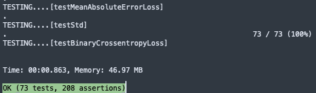

# Neural-Net-PHP 🧠💻

  


## Introduction 🎉
Welcome to Neural-Net-PHP, a comprehensive library designed for implementing neural networks using PHP. This library expertly bridges the gap between the dynamic capabilities of neural networks and the robustness of PHP, offering PHP developers a seamless entry into the realm of artificial intelligence. With Neural-Net-PHP, you can effortlessly explore and harness the power of AI! 🚀

Special acknowledgment and heartfelt gratitude go to Harrison Kinsley & Daniel Kukieła, the authors of [Neural Networks from Scratch in Python](https://nnfs.io/), whose work has been a significant source of inspiration in the creation of this library.


## Table of Contents 📚
- [Introduction 🎉](#introduction)
- [Installation 🛠](#installation)
- [Usage 🚀](#usage)
  - [Loading Data 📂](#loading-data)
  - [Building the Model 🏗️](#building-the-model)
  - [Training 🏋️](#training)
  - [Evaluating and Predicting 🔍](#evaluating-and-predicting)
  - [Saving and Loading Models 💾](#saving-and-loading-models)
- [Components 🧩](#components)
  - [Activation Functions 🔥](#activation-functions)
  - [Optimizers ⚙️](#optimizers)
  - [Layers 🥞](#layers)
  - [Loss Functions 📉](#loss-functions)
  - [Model 📐](#model)
  - [Utility Classes 🛠️](#utility-classes)
- [Examples 📚](#examples)
  - [Fashion-MNIST Training Example 👗](#fashion-mnist-training-example)
  - [Loading and Using a Saved Model 🔄](#loading-and-using-a-saved-model)
- [Technical Considerations 🤔](#technical-considerations)
- [Acknowledgements 🙏🏿](#acknowledgements)
- [License 📝](#license)


## Installation 🛠️

Follow these detailed instructions to install and set up Neural-Net-PHP in your environment.

### Cloning the Repository
Start by cloning the repository from GitHub:
```bash
git clone git@github.com:cuthbert-lwinga/Neural-Net-PHP.git
cd Neural-Net-PHP
```
### Installing Dependencies 📦
Neural-Net-PHP is built entirely from scratch, so no external libraries are required except for PHPUnit to run tests. If you don't have PHPUnit installed, you can easily install it via Composer:
```bash
composer require --dev phpunit/phpunit
```
## Running Tests 🧪
It's crucial to run tests after installation to ensure everything is set up correctly. Execute the PHPUnit tests with:
```bash
./vendor/bin/phpunit
```

You should see an output similar to the following, indicating all tests have passed successfully:


## Components 🧩
Neural-Net-PHP consists of several key components:

### Activation Functions 🔥
- **Activation_Relu**: Introduces non-linearity, allowing the model to learn complex patterns. 
  - Primarily used in hidden layers.
  - Effective in mitigating the vanishing gradient problem.

- **Activation_Softmax**: Used in the output layer for multi-class classification.
  - Converts output to a probability distribution.
  - Suitable for cases where each class is mutually exclusive.

- **Activation_Linear**: Useful for regression tasks or simple transformations.
  - No transformation is applied, maintains the input as is.
  - Commonly used in the output layer for regression problems.

- **Activation_Sigmoid**: Ideal for binary classification problems.
  - Outputs values between 0 and 1, representing probabilities.
  - Often used in the output layer for binary classification.


### Optimizers ⚙️
- **Optimizer_SGD** (`$learning_rate=1.0, $decay=0.0, $momentum=0`): Standard optimizer for training.
  - `$learning_rate`: The step size at each iteration while moving toward a minimum of a loss function.
  - `$decay`: Learning rate decay over each update.
  - `$momentum`: Parameter that accelerates SGD in the relevant direction and dampens oscillations.

- **Optimizer_Adam** (`$learning_rate=0.001, $decay=0.0, $epsilon=1e-7, $beta_1=0.9, $beta_2=0.999`): Advanced optimizer with adaptive learning rate.
  - `$learning_rate`: Initial learning rate for the optimizer.
  - `$decay`: Learning rate decay over each update.
  - `$epsilon`: A small constant for numerical stability.
  - `$beta_1`: Exponential decay rate for the first moment estimates.
  - `$beta_2`: Exponential decay rate for the second-moment estimates.

- **Optimizer_Adagrad** (`$learning_rate=1.0, $decay=0.0, $epsilon=1e-7`): Optimizer that adapts the learning rate to the parameters.
  - `$learning_rate`: The step size at each iteration.
  - `$decay`: Learning rate decay over each update.
  - `$epsilon`: A small constant for numerical stability, preventing division by zero.

- **Optimizer_RMSprop** (`$learning_rate=0.001, $decay=0.0, $epsilon=1e-7, $rho=0.9`): Divides the learning rate by an exponentially decaying average of squared gradients.
  - `$learning_rate`: The step size at each iteration.
  - `$decay`: Learning rate decay over each update.
  - `$epsilon`: A small constant for numerical stability.
  - `$rho`: Discounting factor for the history/coming gradient.


### Layers 🥞
- **Layer_Dense**(`$n_inputs`, `$n_neurons`, `$weight_regularizer_l1 = 0`, `$weight_regularizer_l2 = 0`, `$bias_regularizer_l1 = 0`, `$bias_regularizer_l2 = 0`): Core layer of a neural network, fully connected. 
  - `$n_inputs`: Specifies the number of input features to the layer.
  - `$n_neurons`: Determines the number of neurons in the layer, defining its width.
  - `$weight_regularizer_l1` and `$weight_regularizer_l2`: Regularization parameters for the weights, helping to reduce overfitting by applying penalties on the layer's complexity.
  - `$bias_regularizer_l1` and `$bias_regularizer_l2`: Regularization parameters for the biases, similar to the weights, these help in controlling overfitting.

- **Layer_Dropout** (`$rate`): Applies dropout to prevent overfitting. `$rate` is a value from 0.0 to 1.0 and specifies the fraction of neurons to drop out at random. For example, `$rate = 0.1` means 10% of the neurons will be dropped out at random, helping to prevent overfitting by reducing the model's reliance on any single neuron.

- **Layer_Input**: The initial layer to input the data. This layer doesn't perform any computation or transformation; it simply serves as the starting point for the model's architecture. It's essential for defining the shape and structure of the input data your model will receive. 

### Loss Functions 📉
Neural-Net-PHP includes various loss functions, each suitable for different types of neural network tasks:

- **Loss_CategoricalCrossentropy**: Measures the performance of a classification model where the output is a probability value between 0 and 1. Commonly used in multi-class classification problems.
  - `forward($y_pred, $y_true)`: Computes the loss for each sample.
  - `backward($dvalues, $y_true)`: Calculates the gradient of the loss with respect to the input of the loss function.

- **Loss_BinaryCrossentropy**: Specifically designed for binary classification tasks. It measures the performance of a model with two class output probabilities.
  - `forward($y_pred, $y_true)`: Computes the binary crossentropy loss for each sample.
  - `backward($dvalues, $y_true)`: Calculates the gradient of the loss with respect to the input.

- **Loss_MeanSquaredError**: Used for regression models. It measures the average squared difference between the estimated values and the actual value.
  - `forward($y_pred, $y_true)`: Calculates the mean squared error for each sample.
  - `backward($dvalues, $y_true)`: Computes the gradient of the loss with respect to the predictions.

- **Loss_MeanAbsoluteError**: Another loss function for regression, which measures the average magnitude of errors in a set of predictions, without considering their direction.
  - `forward($y_pred, $y_true)`: Computes the mean absolute error for each sample.
  - `backward($dvalues, $y_true)`: Calculates the gradient of the loss with respect to the predictions.

General Methods for Loss Classes:
- `regularization_loss()`: Computes the regularization loss for the layers, aiding in reducing overfitting.
- `calculate($output, $y, $include_regularization = false)`: Calculates the data loss and optionally includes the regularization loss.
- `new_pass()`: Resets accumulated values, useful for starting a new pass of loss calculation.
- `calculate_accumulated($include_regularization = false)`: Calculates the accumulated mean loss over a period, including regularization loss if specified.

Each of these loss functions plays a crucial role in guiding the training process of your neural network, helping to minimize the difference between the predicted output and the actual target values.

### Model 📐
The `Model` class is the central component of Neural-Net-PHP, orchestrating the neural network's structure, training, evaluation, and predictions.

- **Initialization and Layer Management**
  - `__construct()`: Initializes a new Model instance.
  - `add($layer)`: Adds a layer to the neural network model.
  - `set($loss = null, $optimizer = null, $accuracy = null)`: Sets the loss function, optimizer, and accuracy metric for the model.

- **Parameters and Training**
  - `set_parameters($parameters)`: Sets the parameters for the trainable layers.
  - `get_parameters()`: Retrieves the parameters from the trainable layers.
  - `finalize()`: Prepares the model by connecting layers and setting up for training.
  - `train($X, $y, $epochs, $batch_size, $print_every, $validation_data)`: Trains the model on the provided dataset.

- **Evaluation and Prediction**
  - `evaluate($X_val, $y_val, $batch_size)`: Evaluates the model's performance on the validation dataset.
  - `predict($X, $batch_size)`: Predicts output for the given input data.

- **Saving and Loading**
  - `save_parameters($path, $override)`: Saves the model's parameters to a file.
  - `load_parameters($path)`: Loads the model's parameters from a file.
  - `save($path)`: Saves the entire model to a file.
  - `load($path)`: Static method to load a saved model from a file.

The `Model` class encapsulates all the necessary functionality for building and operating neural networks, making it straightforward to define, train, and utilize complex models in PHP.


### Utility Classes 🛠️
Neural-Net-PHP includes additional utility classes that provide essential functionalities to support the neural network operations.

#### NumpyLight
- A lightweight PHP library that mimics the functionality of Python's Numpy, focusing on matrix operations essential for neural networks. Due to the extensive nature of its functionalities, users are encouraged to inspect the `NumpyLight` class file for a comprehensive understanding of its capabilities.

#### Accuracy
- Abstract class `Accuracy` serves as a base for accuracy calculation in different scenarios.
  - `calculate($predictions, $y)`: Calculates the accuracy of predictions against the ground truth values.
  - `new_pass()`: Resets accumulated values for a new accuracy calculation pass.
  - `calculate_accumulated()`: Calculates the mean accuracy over accumulated values.
- **Accuracy_Regression**: Subclass for regression model accuracy. It uses a precision threshold to determine if predictions are close enough to the ground truths.
- **Accuracy_Categorical**: Subclass for categorical data accuracy. Useful in classification tasks where outputs are discrete classes.

#### LinePlotter
- A utility for plotting lines and points, useful for visualizing data and model results.
  - `__construct($width, $height)`: Initializes the plotter with specified dimensions.
  - `setColor($name, $red, $green, $blue)`: Defines custom colors for plotting.
  - `plotLine($yValues, $colorName)`: Plots a single line graph.
  - `plotMultipleLinesWithYOnly($lines)`: Plots multiple lines using only y-values.
  - `plotLineWithColor($xValues, $yValues, $colorName)`: Plots a line graph with specified colors.
  - `plotPoints($points, $groups)`: Plots individual points, useful for scatter plots.
  - `clearCanvas()`: Clears the current plot, allowing for a new plot to be created.
  - `save($filename)`: Saves the created plot to a file.

These utility classes enhance the Neural-Net-PHP library by providing additional functionalities like matrix operations, accuracy calculations, and data visualization, all crucial for a complete neural network implementation.
## Examples 📚

### Fashion-MNIST Training Example 👗
This example demonstrates how to train a neural network on the Fashion-MNIST dataset using Neural-Net-PHP. The Fashion-MNIST dataset consists of 28x28 grayscale images of fashion items, each categorized into one of 10 different classes like T-shirts/tops, trousers, pullovers, dresses, and more.

Before training, the images are first flattened and scaled. The dataset is shuffled and divided into training and testing sets.

To easily train the model on the Fashion-MNIST dataset, simply navigate to the main directory of `Neural-Net-PHP` and execute the following command in your terminal:

```bash
php /TEST/TrainingTest/train_to_fashion_mnist.php
```

```php
ini_set('memory_limit', '20480M'); // Increase the memory limit to 20480MB (20GB) or as needed
include_once("CLASSES/Headers.php");
use NameSpaceNumpyLight\NumpyLight;

// Loading and preprocessing the dataset
$mnist_data = create_data_mnist("fashion_mnist_images");
list($X, $y, $X_test, $y_test) = $mnist_data;

// Data normalization and reshaping

// Prepare validation data
$validation = [$X_test, $y_test];

// Constructing the model
$Model = new Model();
$Model->add(new Layer_Dense(NumpyLight::shape($X)[1],64));
$Model->add(new Activation_Relu());
$Model->add(new Layer_Dense(64,64));
$Model->add(new Activation_Relu());
$Model->add(new Layer_Dense(64,64));
$Model->add(new Activation_Softmax());
$Model->set(
	$loss_function = new Loss_CategoricalCrossentropy(),
	$optimizer = new Optimizer_Adam($learning_rate = 0.001, $decay = 1e-3),
	$accuracy = new Accuracy_Categorical()
);


// Finalize the model and start training
$Model->finalize();
$Model->train($X, $y, $epoch = 200, $batch_size = 128, $print_every = 100, $validation_data = $validation);

// Saving the trained model
// The model is saved under the name 'fashion_mnist_model' for future use.
$Model->save("fashion_mnist_model");
```
### Loading and Using a Saved Model

Once you have trained and saved a model, you can easily load it for further evaluation or predictions. Here's an example of how to load a model and use it to make predictions on the Fashion-MNIST dataset:

To conveniently demonstrate this functionality, open your terminal and navigate to the main directory of `Neural-Net-PHP`. Then, execute the following command:

```bash
php TEST/TrainingTest/p615.php
```

```php
// Load the saved model
$Model = Model::load('saved_model');

// Predict using the loaded model
$confidences = $Model->predict($X_test);
$predictions = $Model->output_layer_activation->predictions($confidences);

// Fashion-MNIST labels
$fashion_mnist_labels = [
    // Labels mapping
];

// Display predictions along with actual labels
for ($i = 0; $i < count($predictions); $i++) {
    $labelText = $fashion_mnist_labels[$predictions[$i]] . " (Actual: " . $fashion_mnist_labels[$y_test[$i]] . ")";
    $paddedLabelText = str_pad($labelText, 50);

    echo $paddedLabelText . " ";
    echo ($fashion_mnist_labels[$predictions[$i]] == $fashion_mnist_labels[$y_test[$i]]) ? "✅" : "❌";
    echo "\n\n";
}
```

## Technical Considerations 🤔

When working with Neural-Net-PHP, there are several technical aspects to keep in mind for optimal performance and effective model training:

1. **Potential for Threading 💡**: Currently, Neural-Net-PHP operates without the use of threading, which can limit its processing speed. Implementing threading in future updates could significantly enhance performance, especially for complex models and large datasets. This feature is under consideration and may be integrated into later versions of the library.

2. **Memory Management 💾**: Neural networks, particularly when dealing with large datasets or deep architectures, can be memory-intensive. Effective memory management is crucial to prevent bottlenecks and ensure smooth operation.

3. **Data Preprocessing 🔄**: Proper preprocessing of data, such as normalization or encoding categorical variables, is vital for model accuracy and efficiency.

4. **Hardware Considerations 🖥️**: While PHP is not traditionally associated with high-performance computing tasks like neural network training, the choice of hardware can impact training speed. Using a machine with sufficient RAM and a powerful CPU can help mitigate performance issues.

5. **Batch Size Selection 📊**: Choosing the right batch size affects the speed and convergence of the training process. Smaller batch sizes may offer more frequent updates and potentially faster convergence, but larger batches utilize hardware more efficiently.

6. **Regularization Techniques 🔧**: To combat overfitting, it's advisable to employ regularization techniques such as dropout or L1/L2 regularization, especially in complex networks.

7. **Hyperparameter Tuning 🔍**: The process of training a neural network involves several hyperparameters (like learning rate, number of epochs, etc.). Tuning these parameters is critical for achieving optimal model performance.

8. **PHP Environment ⚙️**: Ensure that your PHP environment is correctly set up and configured for running computational tasks. The version of PHP, as well as the configuration settings, can impact the performance of Neural-Net-PHP.

9. **Future Updates and Community Contributions 🌐**: As Neural-Net-PHP evolves, users are encouraged to contribute or provide feedback for continuous improvement of the library. Future updates may include more advanced features, optimizations, and bug fixes.

These considerations aim to guide users for a better experience with Neural-Net-PHP and to set appropriate expectations regarding the library's capabilities and potential areas for future development.

## Acknowledgements 🙏🏿🌟

Reflecting on the creation of Neural-Net-PHP, my heart swells with gratitude for those who've supported me along this wild and wonderful journey:

- **Harrison Kinsley & Daniel Kukieła 📚**: A towering thank you to Harrison Kinsley and Daniel Kukieła, authors of ["Neural Networks from Scratch in Python"](https://nnfs.io/). Their work provided the blueprint that inspired Neural-Net-PHP's architecture and philosophy.

- **PHP Community ❤️**: Kudos to the awesome PHP community. Your innovation and continual growth have transformed Neural-Net-PHP from a dream into a delightful reality.

- **Open Source Contributors 👐**: Hats off to the myriad of open-source pioneers in machine learning and software development. Your trailblazing efforts and open sharing of knowledge are the unsung heroes of projects like this.

- **Early Adopters and Users 🌍**: A big shoutout to everyone who has given Neural-Net-PHP a whirl. Your feedback is the magic ingredient for the ongoing refinement and enhancement of the library.

- **Stephanie, the Unintentional Math Listener 🎧**: To my girlfriend, Stephanie, thank you for enduring endless rants about mathematical conundrums that might as well have been in Klingon. Your patience, support, and encouragement have been my rock (and sanity saver) through this labyrinth of algorithms and code.


The journey of building Neural-Net-PHP has been an extraordinary odyssey filled with late nights, sudden epiphanies, and a plethora of "Aha!" moments, each fueled by an unwavering passion for machine learning. This labor of love, born in the quiet confines of my room, was a series of puzzles waiting to be solved, challenges to be embraced, and victories to be celebrated.

Each hurdle encountered was not merely an obstacle, but a stepping stone that enriched my understanding, sharpened my skills, and fueled my passion for this ever-evolving field. Neural-Net-PHP stands as a testament not only to the power of perseverance and relentless curiosity but also to the joy of learning and the remarkable potential that unfolds when we dare to dream and dare to do.

This project is a tribute to the warmth of community spirit and the boundless possibilities inherent in shared knowledge and collective advancement. To all aspiring coders and dreamers out there, may this serve as a beacon of inspiration. Here's to the journey, the joy of creation, and the endless adventure of coding. Happy coding, and may your path be filled with countless more "Aha!" moments!

## License 📝
Neural-Net-PHP is made available under the MIT License. This means that you're free to use, modify, distribute, and sell this software, but you must include the original copyright notice and this license notice in any copies or substantial portions of the software.
